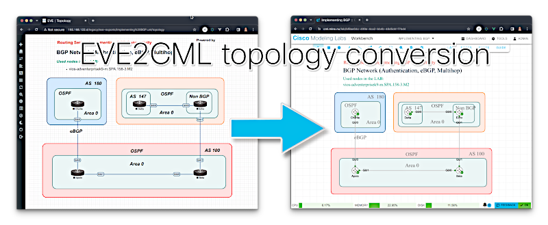

# eve2cml

[](https://coveralls.io/github/CiscoDevNet/eve2cml?branch=main) 



Convert EVE-NG topology files either in ZIP format or in plain-text XML (.unl) to CML2 YAML format.

> [!CAUTION]
>
> This is considered "beta" as in "it works for me but might have bugs or things don't work as you expect them to do."  So, use with care and at your own risk.

### Mapping node types

There's some default node type mappings which can be dumped into a file using the `--dump` flag.

The mapper defines three elements:

- `interface_lists`: A map with a list of interface names for each mapped CML node definitions. The key is the CML node definition ID

- `unknown_type`: Which node definition ID should be inserted into the topology if the EVE node type is not defined in the mapper (a string like "desktop")

- `map`: Maps EVE node types into CML node and image definitions.  The map key is an EVE node type where the format is "eve-node-type:eve-node-template:eve-node-image" (separated by colons).  An example is `qemu:linux`.  When the image part is missing then the CML default image for the mapped node type is used.  The value for each key is of the form:

  - `image_def`: the CML image definition ID for this node definition ID (can safely be null/undefined)
  - `node_def`: the mapped CML node definition ID
  - `override`: a boolean. It determines whether values like CPU or memory should be taken from the EVE definition.  If `true` then the EVE values will not be used, the default values from CML for this particular node type will then be used instead

  There's a specific "corner case" where the type  is identical to the template (e.g. "iol:iol" or "docker:docker").  In this particular case, mapper keys are searched for partial matches where the map key matches the beginning of the provided EVE image.  For example, "iol:iol:i86bi_linux_l2-ipbasek9:" matches all IOL images that start with `i86bi_linux-ipbasek9` and maps the (by default) into `ioll2-xe`.

After modification / adding more or different node type mappings to the exported map YAML, use the file via the `--mapper modified_map.yaml` flag.

Disclaimer:  There's certainly things out there which do not properly translate.  If you encounter anything then raise an issue in the issue tracker and I'll look into it.

### Usage

```
$ eve2cml -h
usage: eve2cml [-h] [--level {debug,info,warning,error,critical}] [--stdout] [--nocolor] [--dump] [--mapper MAPPER] [-t] [--all] file_or_zip [file_or_zip ...]

Convert UNL/XML topologies to CML2 topologies

positional arguments:
  file_or_zip           Path to either a UNL or ZIP with UNL file

optional arguments:
  -h, --help            show this help message and exit
  --level {debug,info,warning,error,critical}
                        specify the log level, default is warning
  --stdout              do not store in files, print to stdout
  --nocolor             no color log output
  --dump                Dump the mapper as YAML
  --mapper MAPPER       custom mapper YAML file
  -t, --text            text output
  --all                 print all objects in text mode

Example: eve2cml exportedlabs.zip

$
```
